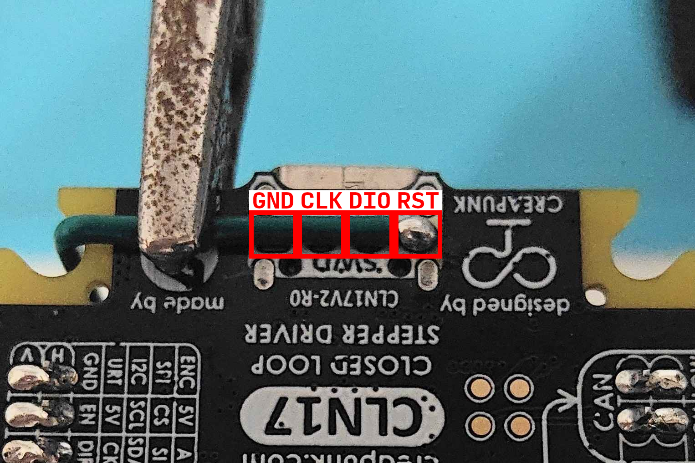
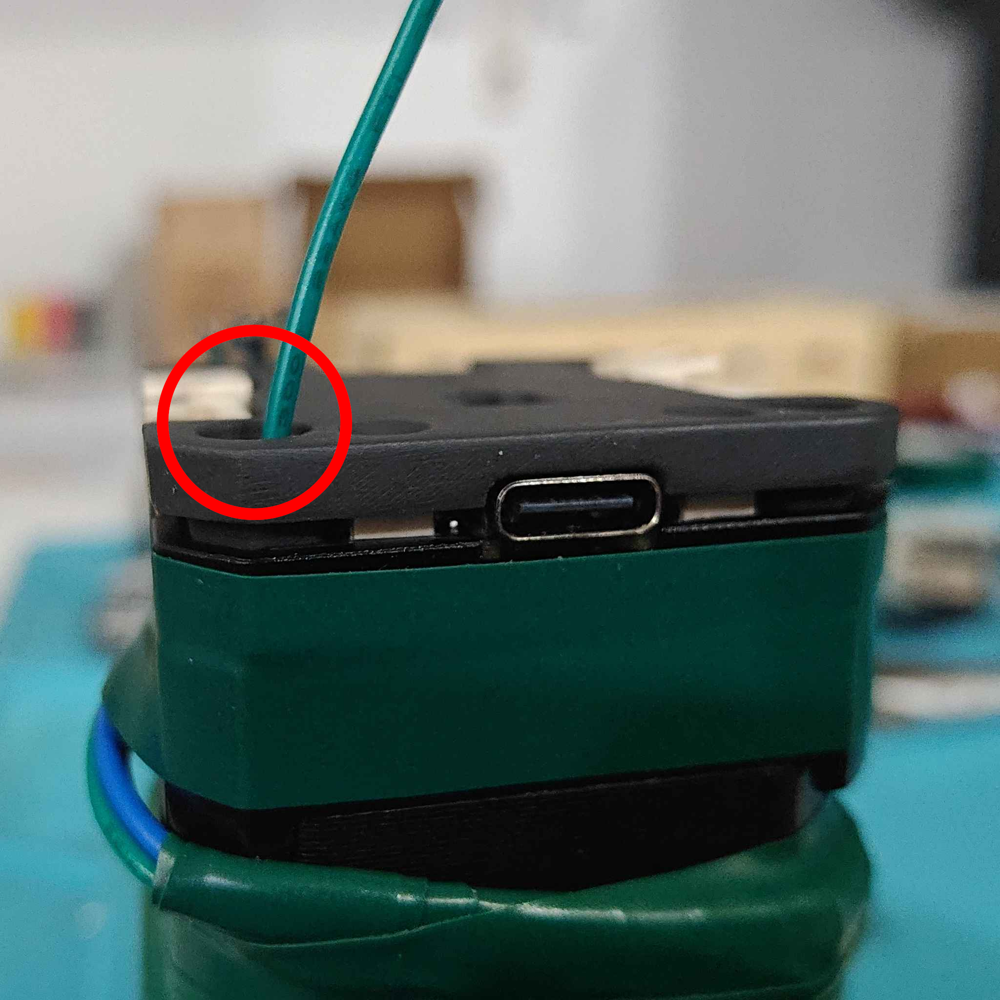
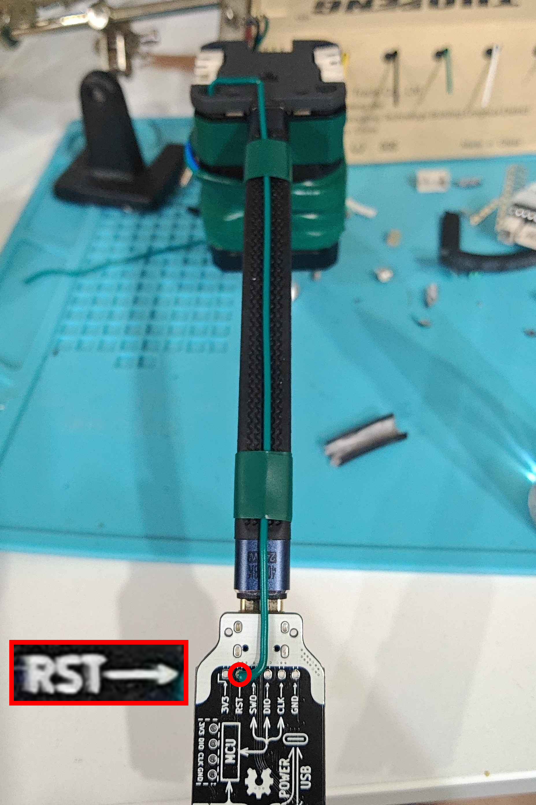
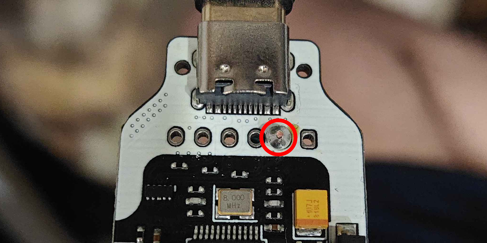

# TunePulseRs

This is a Rust firmware for the Creapunk CLN17 v2.0 stepper motor driver.

## Features

It prints hello world (for now)

## Development

### Prerequisites

- [Rustup](https://rustup.rs)
- [STM32CubeProgrammer](https://www.st.com/en/development-tools/stm32cubeprog.html) ST-Link drivers

### Setup

Make sure you execute all commands inside the project directory. There is a `rust-toolchain.toml` file, so `cargo` will use the correct version of Rust.

#### Software

1. Make sure you have [`rustup`](https://rustup.rs) installed.

2. Make sure you have the [ST-Link drivers](https://www.st.com/en/development-tools/stm32cubeprog.html) installed.
   (Run the installer until it installs the drivers, then just close it. You don't need the programmer, only the drivers.)

3. Install the `probe-rs` CLI tool:

   ```sh
   cargo install cargo-binstall
   cargo binstall probe-rs-tools
   ```

#### Hardware

Solder the RST pin on the ST-Link board to the RST pin on the CLN17 board. This is the only pin that needs to be soldered; the rest go over USB as normal.









### Flashing/Running

Connect the ST-Link port to computer, and connect the port on the other end to the CLN17 board.

Don't connect the device port (the one next to the ST-Link port) to anything.

To flash the firmware and run it, use:

```sh
cargo run
```

Serial output will automatically be streamed to the terminal.

### Debugging

Use the VSCode run configuration to flash and run the code.

The code won't start automatically, so make sure to unpause the debugger once you want it to execute.
